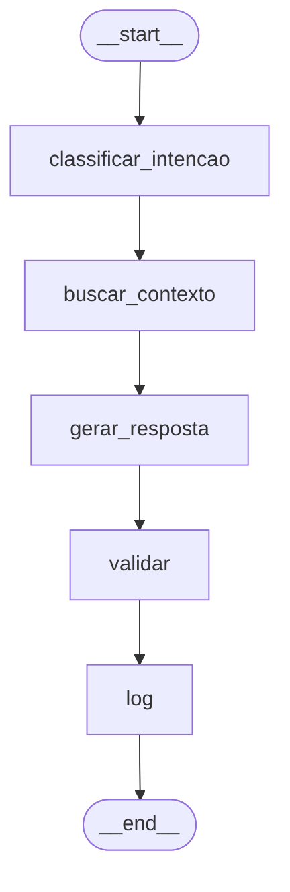
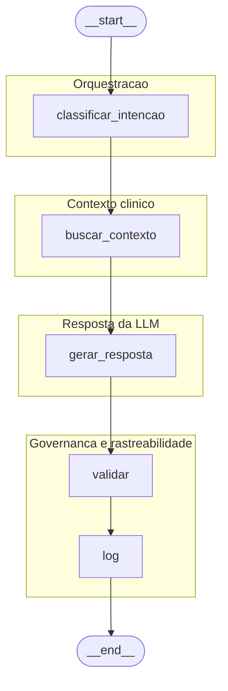

# Mapeamento: Tech Challenge IADT – Fase 3 → arquivos do repositório

**Referência:** `FASE3/Tech Challenge IADT - Fase 3.pdf` (5 páginas)  
**Repositório alvo:** `POSTECH-FIAP-FASE3/`  
**Objetivo deste documento:** associar cada exigência do PDF a **arquivos `.py` / `.ipynb`** (e, quando aplicável, documentação) para facilitar a entrega e a revisão.

---

## Legenda

| Símbolo | Significado |
|--------|-------------|
| ✅ | Implementado no caminho indicado |
| ⚠️ | Parcial / stub / a reforçar na documentação ou no vídeo |
| ❌ | Não implementado no estado atual |
| 📄 | Entrega principalmente em Markdown (relatório), não em código |

---

## 1. Requisitos obrigatórios (entregas técnicas do PDF)

### 1.1 Fine-tuning de LLM com dados médicos internos

**O PDF pede:** fine-tuning (ex.: LLaMA, Falcon ou outro) com protocolos, FAQs, laudos; **preprocessing, anonimização e curadoria**.

| Exigência (resumo) | Arquivo(s) / pasta(s) | Status | Notas |
|--------------------|------------------------|--------|--------|
| Configuração do treino (modelo base, LoRA, hiperparâmetros) | `config/finetune_defaults.py` | ✅ | Qwen2.5-0.5B-Instruct + PEFT/QLoRA |
| Pipeline principal de fine-tuning | `src/models/run_finetune.py` | ✅ | Chamado pelos scripts de treino |
| Script de entrada do treino | `scripts/train_finetune.py` | ✅ | Ponto de execução local |
| Preparação / split dos dados (PubMedQA → JSONL) | `src/data/prepare_pqal.py`, `src/data/split.py` | ✅ | Curadoria e formato para treino |
| Orquestração da preparação | `scripts/run_prepare_data.py` | ✅ | Gera `train.jsonl` / `dev.jsonl` |
| Verificação de dados | `scripts/verify_data.py` | ✅ | Checagens do dataset |
| **Notebook Colab** (mesma linha de treino) | `notebooks/finetune_medical_llm.ipynb` | ✅ | GPU Colab |
| Dados de exemplo (dataset sugerido no PDF) | `data/ori_pqal.json`, `data/train.jsonl`, `data/dev.jsonl`, etc. | ⚠️ | PubMedQA (literatura); dados “do hospital” no sentido estrito seriam extensão futura |

**Observação:** O desafio cita protocolos/laudos internos; no projeto, a base principal é **PubMedQA** (alinhado à sugestão do PDF). Anonimização de PII é mais relevante se forem acrescentados dados reais — ver comentários em `PLANO_DESENVOLVIMENTO_FASE3.md`.

---

### 1.2 Criação de assistente médico com LangChain

**O PDF pede:** pipeline com **LLM customizada**; **consultas a base estruturada** (prontuários); **contextualização** com informações do paciente.

| Exigência (resumo) | Arquivo(s) / pasta(s) | Status | Notas |
|--------------------|------------------------|--------|--------|
| Chain: prompt + LLM fine-tunada + disclaimers / fonte | `src/chains/medical_assistant.py` | ✅ | Integração com modelo PEFT |
| Carregamento HF + `HuggingFacePipeline` (LangChain) | `src/models/load_llm_for_langchain.py` | ✅ | |
| Script CLI do assistente (Step 5) | `scripts/run_assistant.py` | ✅ | |
| **Contexto na pergunta** (abstracts / texto opcional) | `medical_assistant.py` (`ask`, parâmetro `contexto`) | ✅ | Contextualização por string |
| **Base estruturada (prontuário / DB)** | `src/graphs/medical_flow.py` → nó `buscar_contexto` | ⚠️ | Hoje **stub**; ponto de extensão (SQL/JSON/tools LangChain) |
| Demo no Colab (assistente + deps) | `notebooks/run_graph_assistant_colab.ipynb` | ✅ | Inclui clone, `MODEL_DIR`, grafo |

---

### 1.3 Segurança e validação

**O PDF pede:** limites de atuação; **logging** para auditoria; **explainability** (ex.: fonte da informação).

| Exigência (resumo) | Arquivo(s) / pasta(s) | Status | Notas |
|--------------------|------------------------|--------|--------|
| Limites / aviso legal (não substitui médico) | `src/chains/medical_assistant.py` → `DISCLAIMER` | ✅ | Texto fixo nas respostas |
| Indicação de uso de contexto / “fonte” | `medical_assistant.py` → `ask()` (`source_note`) | ⚠️ | Explainability básica (ainda sem citação documental formal por trecho) |
| Validação da resposta no fluxo | `src/graphs/medical_flow.py` → nó `validar` | ✅ | Ex.: resposta não vazia / “Decision:” |
| Logging / trilha de execução no grafo | `medical_flow.py` → estado `historico`, nó `log` | ✅ | Rastreio por nó |
| Documentação de segurança (Step 5) | `docs/assistente_langchain_step5.md` | ✅ | |

---

### 1.4 Organização do código

**O PDF pede:** projeto **modularizado em Python**; **README** completo.

| Exigência | Arquivo(s) / pasta(s) | Status |
|-----------|------------------------|--------|
| Estrutura modular | `src/` (`chains/`, `graphs/`, `models/`, `data/`), `config/`, `scripts/` | ✅ |
| Instruções de uso | `README.md` | ✅ |
| Plano alinhado ao desafio | `PLANO_DESENVOLVIMENTO_FASE3.md` | ✅ |
| Dependências | `requirements.txt` | ✅ |

---

## 2. Entregáveis explícitos do PDF (repositório Git)

| Entregável do PDF | Onde está no repositório | Status |
|-------------------|---------------------------|--------|
| **Pipeline de fine-tuning** | `scripts/train_finetune.py`, `src/models/run_finetune.py`, `config/finetune_defaults.py`, `notebooks/finetune_medical_llm.ipynb` | ✅ |
| **Integração com LangChain** | `src/chains/medical_assistant.py`, `src/models/load_llm_for_langchain.py`, `scripts/run_assistant.py` | ✅ |
| **Fluxos LangGraph** | `src/graphs/medical_flow.py`, `src/graphs/__init__.py`, `scripts/run_graph_assistant.py`, `docs/langgraph_step6.md`, `notebooks/run_graph_assistant_colab.ipynb` | ✅ |
| **Dataset anonimizado ou exemplo sintético** | `data/` (ex.: `ori_pqal.json`, splits em `.jsonl`); scripts em `src/data/` e `scripts/run_prepare_data.py` | ⚠️ |
| **README** | `README.md` | ✅ |

---

## 3. Relatório técnico (PDF)

O PDF pede relatório com: fine-tuning; descrição do assistente; **diagrama** do fluxo LangChain; **avaliação** e resultados.

| Item do relatório | Sugestão de arquivo no repo | Status | Conteúdo |
|-------------------|-----------------------------|--------|----------|
| Processo de fine-tuning | 📄 Complementar: `docs/RELATORIO_TECNICO_FASE3.md` (criar ou consolidar) | ⚠️ | Pode reutilizar trechos de `README.md`, `docs/validacao_outputs_finetune.md`, `PLANO_DESENVOLVIMENTO_FASE3.md` |
| Assistente médico | `docs/assistente_langchain_step5.md`, `docs/langgraph_step6.md` | ✅ | |
| Diagrama LangChain / LangGraph | 📄 Figura exportada ou Mermaid em relatório; texto em `docs/langgraph_step6.md` | ⚠️ | `draw_ascii()` / `--draw` em `scripts/run_graph_assistant.py` ajudam a gerar visão do grafo |
| Avaliação e métricas | `src/models/evaluate_pqal.py`, `scripts/run_evaluate.py`, `scripts/compute_metrics.py`, `notebooks/evaluate_pqal_colab.ipynb`, `docs/relatorio_avaliacao_rascunho.md` | ✅ | |

> **Nota:** O relatório final costuma ser um **PDF ou DOC** entregue na plataforma; os arquivos acima são a **base técnica** para redigir esse documento.

### Bloco pronto (Mermaid) para o relatório

O ASCII de `notebooks/run_graph_assistant_colab.ipynb` **é válido** como diagrama técnico.
Se quiser uma versão visual mais limpa para relatório/slides, use:

### Bloco pronto (Mermaid) com agrupamentos para apresentação

Versão equivalente, porém com blocos semânticos para leitura executiva:

---

## 4. Vídeo (até 15 min) — não é `.py` / `.ipynb`

| Cena sugerida no PDF | O que mostrar (ligação com o código) | Status |
|----------------------|----------------------------------------|--------|
| Treino e LLM personalizada | Colab `finetune_medical_llm.ipynb` ou log de `train_finetune.py` | ⚠️ |
| Fluxo automatizado | `run_graph_assistant_colab.ipynb` ou `run_graph_assistant.py` | ⚠️ |
| Perguntas contextualizadas | `run_assistant.py` / células do notebook com `contexto` | ⚠️ |
| Logs e validação | Saída do grafo (`historico`, `valido`) em `medical_flow.py` | ⚠️ |

---

## 5. Tabela rápida: um arquivo → principal contribuição ao desafio

| Arquivo | Contribuição principal |
|---------|-------------------------|
| `config/finetune_defaults.py` | Hiperparâmetros e modelo base do fine-tuning |
| `src/models/run_finetune.py` | Core do treino |
| `scripts/train_finetune.py` | CLI do treino |
| `src/data/prepare_pqal.py` | Preprocessamento PubMedQA |
| `scripts/run_prepare_data.py` | Geração de JSONL |
| `notebooks/finetune_medical_llm.ipynb` | Fine-tuning no Colab |
| `src/chains/medical_assistant.py` | Assistente LangChain + segurança textual |
| `src/models/load_llm_for_langchain.py` | LLM customizada no LangChain |
| `scripts/run_assistant.py` | Execução assistente (CLI) |
| `src/graphs/medical_flow.py` | LangGraph + logging + validação |
| `scripts/run_graph_assistant.py` | CLI do grafo + opção `--draw` |
| `notebooks/run_graph_assistant_colab.ipynb` | Colab: LangGraph + assistente |
| `src/models/evaluate_pqal.py` | Avaliação |
| `scripts/run_evaluate.py` | CLI avaliação |
| `notebooks/evaluate_pqal_colab.ipynb` | Avaliação no Colab |
| `README.md` | Instruções gerais |
| `docs/langgraph_step6.md` | Documentação Step 6 |
| `docs/assistente_langchain_step5.md` | Documentação Step 5 |

---

## 6. Lacunas típicas em relação ao texto “ideal” do PDF

| Tópico do PDF | Situação no projeto | Status |
|----------------|---------------------|--------|
| Dados internos do hospital (protocolos, laudos reais) | Uso de **PubMedQA** + pipeline pronto para outros JSONLs | ⚠️ |
| Consulta a prontuário em BD estruturado | **Stub** em `buscar_contexto`; evoluir com SQL + Tool LangChain | ⚠️ |
| Relatório único em PDF para banca | Consolidar docs em um **`RELATORIO_TECNICO_FASE3.md`** ou entregável externo | ❌ |

---

*Documento gerado para apoiar a organização das entregas do Tech Challenge Fase 3. Atualize os caminhas se novos scripts forem adicionados.*
